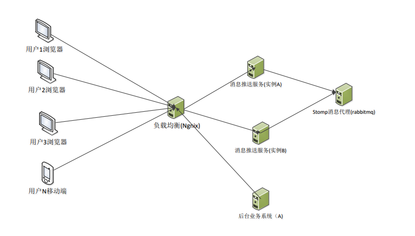
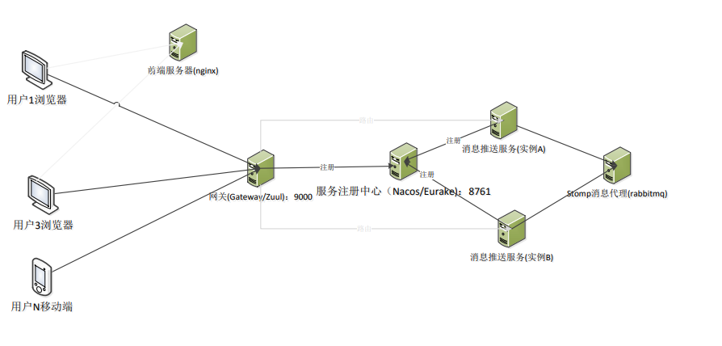

# LoadBalance 负载均衡

> 不同的客户链接负载均衡连接到不同的实例
> * 不同实例的客户连接之间如何实现相互的消息推送
> * 其他业务数据库推送所有链接，如何保证各个实例可以保证推送消息

* **方案一**： Nginx 负载均衡 + 基于 Simple Broker 内存实现消息推送
    
  1. 实例间依靠缓存(`Redis`)共享客户端连接信息
  2. 实例间依靠服务间调用，传递推送业务需求

* **方案二**： Nginx 负载均衡 + 基于 STOMP Broker 实习消息推送 + 消息队列集群(`RabbitMQ`)

  1. 实例间共享使用同一个 STOMP Broker 集群

* **方案三**： Nginx 一级负载均衡 + Spring Cloud Gateway 集群二级负载 + 服务注册中心(`Nacos`/`Eurake`) + 基于 STOMP Broker 实习消息推送 + 消息队列集群(`RabbitMQ`)

  1. 实例间共享使用同一个 STOMP Broker 集群(RabbitMQ)
  2. 实例与网关统一通过注册中心实现服务注册发现


## 方案二

**Nginx 配置：** 
* 不可以使用容器内 IP ，会导致代理失败
* 代理端口需要暴露到容器外

```text
upstream stomp-cluster
{
    server 192.168.99.57:8801 weight=1; # use host ip <not container ip>
    server 192.168.99.57:8802 weight=1; # use host ip <not container ip>
}

server
{
    listen 8800;
    server_name localhost;
    location /{
        proxy_pass http://stomp-cluster/;
    }
}
```

```shell
docker run -d --name nginx -p 80:80 -p 8800:8800 --read-only -v /d/volumes/nginx/cache:/var/cache/nginx -v /d/volumes/nginx/run:/var/run -v /d/volumes/nginx/nginx.conf:/etc/nginx/nginx.conf:ro -v /d/volumes/nginx/html:/usr/share/nginx/html:ro nginx:1.23
```



## 方案三

* 注册中心: Eureka(8860)
* 网关: Spring Gateway(8880)
* Nginx: 前端资源分发 + 一级负载均衡代理

> WebSocket 多实例 VM options: `-Dserver.port=potNumber` 


